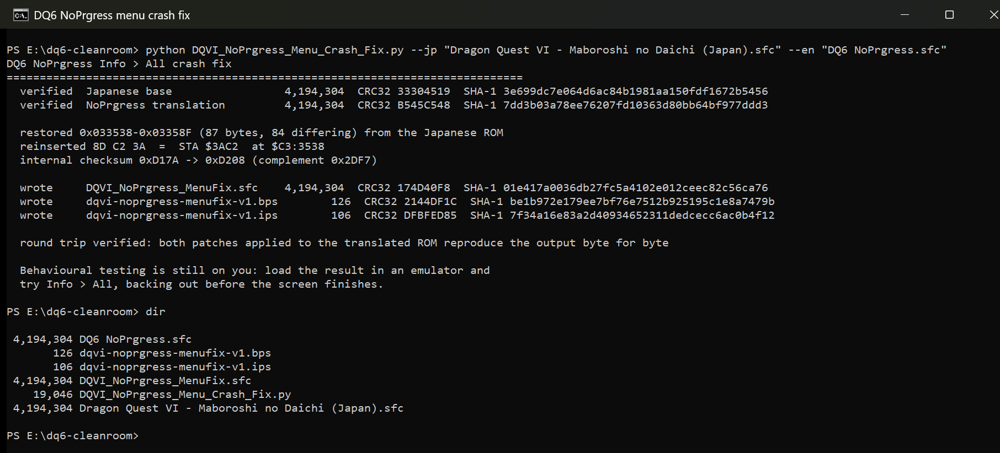

# DQ6 Info > All crash fix, for the NoPrgress translation

Fixes the hard hang in **Dragon Quest VI: Maboroshi no Daichi** (Super Famicom)
when you open **Info > All** and back out before the screen finishes drawing,
in the **NoPrgress / DeJap English translation v0.90b2**.

The cause is a single missing instruction. The translation is short one
three-byte opcode, `STA $3AC2` at `$C3:3538`, which the Japanese original
executes. This repository publishes a patch that restores it, the analysis
behind it, and a script that builds the fix from your own ROMs.

---

## Credits

**This is a three-byte correction to somebody else's large piece of work.**

- **NoPrgress**, and **DeJap Translations** before them, for the English
  translation of Dragon Quest VI. This is a Japan-only release that stayed
  unplayable in English for over a decade. Translating a 4 MB Super Famicom RPG
  means rebuilding its text engine, refitting menus around a script that does
  not fit, and hand-editing 65816 assembly, all unpaid.
- The defect fixed here is **one deleted instruction in an area they were
  actively editing**, and it sits immediately after a run of inline parameter
  bytes, which is exactly the kind of place a byte count goes wrong. Everything
  else in that routine is intact, right down to the string identifiers. This is
  a slip in difficult work, not a failing, and the translation is the reason
  this repository can exist at all.
- **Enix**, publisher of the original 1995 game, whose rights now sit with
  Square Enix. The fix does not add anything; it puts their bytes back.

---

## No ROMs here. Bring your own.

This repository contains **patches and a script only**. It does not, and will
not, contain a ROM image, the NoPrgress translation patch, or any pre-patched
build. You supply:

| What | Size | CRC32 | SHA-1 |
|---|---:|---|---|
| Dragon Quest VI, Japanese, headerless | 4,194,304 | `33304519` | `3e699dc7e064d6ac84b1981aa150fdf1672b5456` |
| The same ROM with NoPrgress v0.90b2 applied | 4,194,304 | `B545C548` | `7dd3b03a78ee76207fd10363d80bb64bf977ddd3` |

Get the translation patch from its own authors. Both ROMs must be **headerless**
(no 512-byte copier header).

---

## What goes wrong

Open the menu, choose **Info**, choose **All**, and press cancel before the
status screen has finished drawing. The game locks up completely: no crash
screen, no reset, just a frozen picture and music that keeps playing.

Romhacking.net's entry for the translation documents this and advises keeping
savestates handy. It is reproducible on demand once you know the timing, and it
happens with a **single party member at level 1 with no equipment**, so it is
not about long names or long item names.

**The Equip menu does not crash.** It has sometimes been described as a second
crash site; it was tested with the same interrupted sequence and does not fault.
The scope here is Info > All only.

This patch does not address the separate hang involving the "Forget" skill in
the Remember conversation system, which is a different site.

---

## Root cause, short version

A loop over party slots reads its upper bound from `$7E:3AC2`. Two things write
that address: one writes a sentinel `0xFF` meaning "not applicable", and another
writes the real party size over the top of it.

The Japanese ROM does both, in that order, every time. The translation is
missing the second write, so the bound stays at `0xFF`. The loop then accepts
slot index 1 on a one-member party, reads a table entry that was never
initialised, and hits an assertion the original developers left in the shipped
game: an infinite branch-to-itself at `$C4:560F`. The game does not crash, it
spins there forever.

Measured, from emulator trace logs of both ROMs running the same sequence:

```
Japanese : the bound reads $0001 at all 20 executions of the comparison
NoPrgress: the bound reads $00FF at 4 of 5, including the fatal one
```

Full detail, including the byte-level proof and the safety checks on the patch,
is in **[docs/ANALYSIS.md](docs/ANALYSIS.md)**.

---

## How to apply

Two routes. Route A needs one ROM, route B needs both.

### Route A, the patch, with Flips

Use [Flips](https://github.com/Alcaro/Flips). Apply
`dqvi-noprgress-menufix-v1.bps` to your **already-translated** ROM.

```
flips --apply dqvi-noprgress-menufix-v1.bps "DQ6 NoPrgress.sfc" "DQ6 Fixed.sfc"
```

**The patch targets the translated ROM (`B545C548`), not the Japanese base.**
BPS records its expected source, so Flips will refuse a wrong ROM rather than
producing a broken one. An IPS is included for tools that cannot read BPS, but
IPS cannot validate its input, so prefer the BPS.

### Route B, the script, from both ROMs

```
python DQVI_NoPrgress_Menu_Crash_Fix.py --jp "Dragon Quest VI - Maboroshi no Daichi (Japan).sfc" --en "DQ6 NoPrgress.sfc"
```

Python 3.8 or newer, standard library only, no pip and no external tools. It
verifies both inputs by SHA-1, checks the target bytes are what it expects,
refuses to write anything if either check fails, and never modifies its inputs.
`--help` explains what you need to supply. Route B also regenerates both patch
files, so you can confirm they match the ones shipped here.



### What you should end up with

| | Size | CRC32 | SHA-1 |
|---|---:|---|---|
| `DQVI_NoPrgress_MenuFix.sfc` | 4,194,304 | `174D40F8` | `01e417a0036db27fc5a4102e012ceec82c56ca76` |
| `dqvi-noprgress-menufix-v1.bps` | 126 | `2144DF1C` | `be1b972e179ee7bf76e7512b925195c1e8a7479b` |
| `dqvi-noprgress-menufix-v1.ips` | 106 | `DFBFED85` | `7f34a16e83a2d40934652311dedcecc6ac0b4f12` |

The fixed ROM differs from the translated one in exactly **88 bytes**:

```
0x00FFDC - 0x00FFE0    4 bytes    recomputed internal checksum and complement
0x033538 - 0x03358C   84 bytes    the restored instruction, and the 3-byte shift it undoes
```

The internal checksum goes from `0xD17A` to `0xD208`. NoPrgress shipped a
correct checksum, so recomputing it after changing the ROM is the right thing to
do here rather than leaving a stale value behind.

---

## Testing status

**Confirmed working in game, 2026-08-17.**

Tested on `DQVI_NoPrgress_MenuFix.sfc`, CRC32 `174D40F8`, SHA-1
`01e417a0036db27fc5a4102e012ceec82c56ca76`, in **MesenCE**, with a **solo party
at level 1** with no equipment. That is the exact state that used to reproduce
the hang on demand.

- The previously fatal sequence, **enter Info > All and back out before the
  screen finishes drawing**, was repeated and **no longer hangs**.
- The normal path, entering and letting the screen finish before backing out,
  also works.
- **The two phantom empty party windows are gone**, and **the Def column now
  shows a number instead of `?`**.

That last point is the part worth dwelling on. Those two artefacts were the
visible face of the same defect: the slot loop was running past the end of the
party, drawing windows for members that do not exist and reading stats that were
never initialised. They disappear because the loop bound is correct again, which
is evidence the **cause** was fixed rather than the crash merely suppressed. A
guard that only stopped the hang would have left both artefacts on screen.

### Confirmed at instruction level

The behavioural result above has since been backed by an emulator trace of the
fixed build, on a save with a **full eight-member party**. The restored
instruction does exactly what the analysis predicted:

- `$C3:3538 STA $3AC2` executes **8 times, writing `$0008`**, the real party
  size. This is the instruction that was deleted; before the fix it did not
  exist.
- `$C3:964A CMP $3AC2` reads **`$0008` at all 8 executions**, never the `$00FF`
  sentinel that caused the hang.
- **7 of those 8 comparisons reject the slot** and take the early exit at
  `$C3:964F`, with 1 proceeding. That is the same ratio the Japanese ROM
  produces.
- `$C4:560A` reads `$7E:3EEE` with `X:0000`, not the uninitialised `$7E:3EEF`.
- The original developers' assertion at `$C4:560F` executes **once and never
  with `Z` set**, so it is passed harmlessly rather than tripped.

Info > All has now been exercised at **two party sizes**, a solo level 1
character and a full eight-member party, with no hang on either.

**Not verified:** a full playthrough, and emulators other than MesenCE. Reports
welcome in the issues.

Also verified, before any of the above:

- The defect was identified by diffing emulator trace logs of the Japanese and
  translated ROMs running the same interrupted sequence, not inferred from
  reading code. The faulting instruction, the register state at the fault, and
  the missing write are all measured.
- The 87-byte restoration span is byte-for-byte the Japanese original, so the
  routine ends up matching the original code exactly.
- Nothing references the middle of the shifted span: no branches in, no
  same-bank `JSR` or `JMP`, no window-descriptor handlers. Checked explicitly,
  see the analysis.
- The deliberate translation edit immediately after the span, at `$C3:3594`, is
  preserved. The patch stops before it.
- Both patches, applied to the translated ROM, reproduce the fixed ROM byte for
  byte. Cross-checked against Flips as the reference implementation rather than
  only against this repository's own code: Flips applies both of these patches
  to the same result, and a patch Flips generates independently produces the
  same result too.
- The script was re-run from an empty directory and reproduced every hash.
- Failure paths were exercised: wrong ROM, swapped arguments, missing file,
  already-fixed input. Each stops with a specific message and writes nothing.

Nothing about the fix is now resting on inference. The defect, the restored
bytes, the patch mechanics, the in-game behaviour and the instruction-level
mechanism have all been measured.

---

## Contents

```
README.md                          this file
DQVI_NoPrgress_Menu_Crash_Fix.py   builds the fix from both ROMs, stdlib only
dqvi-noprgress-menufix-v1.bps      patch, targets the translated ROM B545C548
dqvi-noprgress-menufix-v1.ips      same patch as IPS, for older tools
docs/ANALYSIS.md                   how the bug was found, and why the fix is safe
LICENSE
```

---

## License

See [LICENSE](LICENSE). The script and the documentation are the original work
here. The patch itself is a difference against NoPrgress's translation and
restores original bytes that Square Enix now holds the rights to; it is
published in the same spirit as the translation it corrects, and it is useless
without a ROM you already have.
