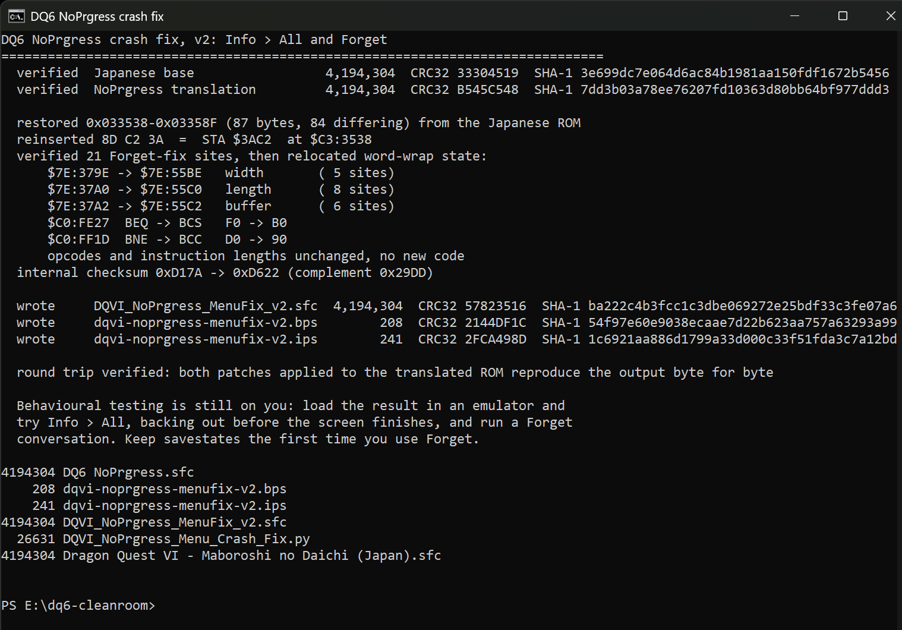

# DQ6 crash fixes, for the NoPrgress translation

Fixes two hard hangs in **Dragon Quest VI: Maboroshi no Daichi** (Super Famicom)
under the **NoPrgress / DeJap English translation v0.90b2**:

- **Info > All**, when you back out before the status screen finishes drawing.
- **Forget**, in the Remember conversation system.

This repository publishes the patches, the analysis behind them, and a script
that builds them from your own ROMs.

---

## Which patch do you want?

Two patches are available. They are a **choice, not a sequence**. v1 remains
available and is the recommended option if you want only the verified minimum.

### v1 - Info > All only, the conservative option

Fixes the hang when you open Info > All and back out before the screen finishes
drawing. The change is minimal: 87 bytes restored so the routine matches the
Japanese original byte for byte, reinstating a deleted `STA $3AC2`. Verified at
instruction level. Nothing else in the game is altered.

### v2 - adds the Forget fix

Everything in v1, plus a fix for the crash in the Forget sequence.

This one relocates word-wrap state that the translation placed inside a block of
memory the original game clears wholesale, moving it to a region established as
unused by static and dynamic analysis.

The residual risk, stated plainly: that region was chosen from emulator code and
data logs, two RAM snapshots, and instruction traces covering field movement,
dialogue, shops, menus and battle. No logged session covers every context in the
game, and code that has never executed cannot be ruled out. If you want only the
change that is verified against the Japanese original, take v1.

**Keep savestates the first time you use Forget.** See "What these patches do not
fix" below for why.

Despite the name `menufix`, kept for continuity with v1, v2 covers both crashes.

---

## The two patches are not stackable

**If you already applied v1, you cannot apply v2 on top of it.** Start again from
the unmodified NoPrgress ROM.

v2 already contains the v1 fix. Applying one to the output of the other will not
work: the BPS will refuse outright, because it records the CRC32 of the ROM it
expects, and an IPS will silently produce a broken ROM. Both patches target the
same starting point:

```
Dragon Quest VI with NoPrgress v0.90b2 applied, headerless, 4,194,304 bytes
CRC32  B545C548
SHA-1  7dd3b03a78ee76207fd10363d80bb64bf977ddd3
```

Check that hash before you patch. It is the single most common thing to get
wrong.

---

## Credits

**These are small corrections to somebody else's large piece of work.**

- **NoPrgress**, and **DeJap Translations** before them, for the English
  translation of Dragon Quest VI. This is a Japan-only release that stayed
  unplayable in English for over a decade. Translating a 4 MB Super Famicom RPG
  means rebuilding its text engine, refitting menus around a script that does
  not fit, and hand-editing 65816 assembly, all unpaid.
- The Info > All defect is **one deleted instruction in an area they were
  actively editing**, sitting immediately after a run of inline parameter bytes,
  which is exactly the kind of place a byte count goes wrong. The Forget defect
  is a memory allocation that collides with the original game's, which is the
  kind of thing that is close to invisible without the original developers'
  memory map. Both are slips in difficult work, not failings, and the
  translation is the reason this repository can exist at all.
- **Enix**, publisher of the original 1995 game, whose rights now sit with
  Square Enix. The fixes add nothing; they put bytes back and move three
  variables out of the way.

---

## No ROMs here. Bring your own.

This repository contains **patches and a script only**. It does not, and will
not, contain a ROM image, the NoPrgress translation patch, or any pre-patched
build. You supply:

| What | Size | CRC32 | SHA-1 |
|---|---:|---|---|
| Dragon Quest VI, Japanese, headerless | 4,194,304 | `33304519` | `3e699dc7e064d6ac84b1981aa150fdf1672b5456` |
| The same ROM with NoPrgress v0.90b2 applied | 4,194,304 | `B545C548` | `7dd3b03a78ee76207fd10363d80bb64bf977ddd3` |

Get the translation patch from its own authors. Both ROMs must be **headerless**
(no 512-byte copier header). The Japanese ROM is only needed for the script,
which restores bytes from it; the patches need only the translated ROM.

---

## What goes wrong

### Info > All

Open the menu, choose **Info**, choose **All**, and press cancel before the
status screen has finished drawing. The game locks up completely: no crash
screen, no reset, just a frozen picture and music that keeps playing.

Romhacking.net's entry for the translation documents this and advises keeping
savestates handy. It is reproducible on demand once you know the timing, and it
happens with a **single party member at level 1 with no equipment**, so it is
not about long names or long item names.

**The Equip menu does not crash.** It has sometimes been described as a second
crash site; it was tested with the same interrupted sequence and does not fault.

### Forget

Using **Forget** in the Remember conversation system produces jumbled repeating
text and then a black screen, with the game unrecoverable.

This is **not** intermittent, despite appearances. It is deterministic, and
depends on whether one of the original game's periodic memory clears happens to
fall in the middle of a message.

---

## Root cause, short version

### Info > All

A loop over party slots reads its upper bound from `$7E:3AC2`. Two things write
that address: one writes a sentinel `0xFF` meaning "not applicable", and another
writes the real party size over the top of it.

The Japanese ROM does both, in that order, every time. The translation is
missing the second write, so the bound stays at `0xFF`. The loop then accepts
slot index 1 on a one-member party, reads a table entry that was never
initialised, and hits an assertion the original developers left in the shipped
game: an infinite branch-to-itself at `$C4:560F`. The game does not crash, it
spins there forever.

Measured, from emulator trace logs of both ROMs running the same sequence:

```
Japanese : the bound reads $0001 at all 20 executions of the comparison
NoPrgress: the bound reads $00FF at 4 of 5, including the fatal one
```

### Forget

A memory allocation collision. The translation keeps its word-wrap state in
three variables at `$7E:379E`, `$7E:37A0` and `$7E:37A2`. All three sit inside a
112-byte block at `$7E:3768`-`$37D6` that the original game clears wholesale, in
code byte-identical to the Japanese ROM.

When a clear lands mid-message, the buffer and its length are destroyed
underneath a live cursor. What follows is a nine-step chain ending in a black
screen, traced instruction by instruction.

The fix moves the three variables somewhere the original game does not touch. It
changes **operands only**: same opcodes, same instruction lengths, no new code,
no hook, and no ROM free space consumed.

Full detail for both, including the byte-level proof, the refuted hypotheses and
the measurement errors made along the way, is in
**[docs/ANALYSIS.md](docs/ANALYSIS.md)**.

---

## How to apply

Two routes. Route A needs one ROM, route B needs both.

### Route A, the patch, with Flips

Use [Flips](https://github.com/Alcaro/Flips). Apply the patch you want to your
**already-translated** ROM.

```
flips --apply dqvi-noprgress-menufix-v1.bps "DQ6 NoPrgress.sfc" "DQ6 Fixed.sfc"
flips --apply dqvi-noprgress-menufix-v2.bps "DQ6 NoPrgress.sfc" "DQ6 Fixed.sfc"
```

**Both patches target the translated ROM (`B545C548`), not the Japanese base,
and not each other's output.** BPS records its expected source, so Flips will
refuse a wrong ROM rather than producing a broken one. An IPS is included for
tools that cannot read BPS, but IPS cannot validate its input, so prefer the BPS.

### Route B, the script, from both ROMs

```
python DQVI_NoPrgress_Menu_Crash_Fix.py --jp "Dragon Quest VI - Maboroshi no Daichi (Japan).sfc" --en "DQ6 NoPrgress.sfc"
python DQVI_NoPrgress_Menu_Crash_Fix.py --jp "Dragon Quest VI - Maboroshi no Daichi (Japan).sfc" --en "DQ6 NoPrgress.sfc" --version 2
```

Python 3.8 or newer, standard library only, no pip and no external tools.
`--version 1` is the default, so the command that built v1 still builds v1. It
verifies both inputs by SHA-1, checks that every byte it is about to change
holds exactly what it expects, refuses to write anything if any check fails, and
never modifies its inputs. `--help` explains what you need to supply. Route B
also regenerates the patch files, so you can confirm they match the ones shipped
here.



v1 produces the same shape of output, in
[screenshots/script-run.png](screenshots/script-run.png).

---

## Identifying what you have

CRC32 is **useless for identifying a `.bps` file**: every valid BPS patch
self-checks to `2144DF1C` by construction, so both patches below show the same
value. Use SHA-1.

| File | Size | SHA-1 |
|---|---:|---|
| `dqvi-noprgress-menufix-v1.bps` | 126 | `be1b972e179ee7bf76e7512b925195c1e8a7479b` |
| `dqvi-noprgress-menufix-v1.ips` | 106 | `7f34a16e83a2d40934652311dedcecc6ac0b4f12` |
| `dqvi-noprgress-menufix-v2.bps` | 208 | `54f97e60e9038ecaae7d22b623aa757a63293a99` |
| `dqvi-noprgress-menufix-v2.ips` | 241 | `1c6921aa886d1799a33d000c33f51fda3c7a12bd` |

And the ROMs they produce:

| Output | Size | CRC32 | SHA-1 |
|---|---:|---|---|
| v1, `DQVI_NoPrgress_MenuFix.sfc` | 4,194,304 | `174D40F8` | `01e417a0036db27fc5a4102e012ceec82c56ca76` |
| v2, `DQVI_NoPrgress_MenuFix_v2.sfc` | 4,194,304 | `57823516` | `ba222c4b3fcc1c3dbe069272e25bdf33c3fe07a6` |

**v1 changes 88 bytes** against the translated ROM:

```
0x00FFDC - 0x00FFE0    4 bytes    recomputed internal checksum and complement
0x033538 - 0x03358C   84 bytes    the restored instruction, and the 3-byte shift it undoes
```

**v2 changes 128 bytes**:

```
0x00FFDC - 0x00FFE0    4 bytes    recomputed internal checksum and complement
0x033538 - 0x03358C   84 bytes    the Info > All restoration, identical to v1
19 sites in bank $C0  38 bytes    relocated operands, 2 bytes each
0x00FE27, 0x00FF1D     2 bytes    two branch conditions
```

Internal checksum goes from `0xD17A` to `0xD208` for v1 and `0xD622` for v2.
NoPrgress shipped a correct checksum, so recomputing it after changing the ROM
is the right thing to do rather than leaving a stale value behind.

---

## What these patches do not fix

These patches fix two specific crashes. Everything else about the translation is
unchanged, including the following, which are **inherited and out of scope**.

If you hit any of it, it came with the translation and is not a defect in these
fixes.

### Untranslated text

The NoPrgress translation is roughly 90% complete. Romhacking.net describes the
remainder as "random strings here and there that have no real bearing on the
game."

**These patches change no text whatsoever.** They do not add, alter or complete
any translation. Japanese text you encounter in play is original to the
translation, not caused by these patches.

For what it is worth, the main dialogue is not where the gap is. The message
table holds 870 entries, and all 870 decode to the English glyph set: 123
distinct symbols across roughly 430,000 decoded characters, with no
Japanese-scale symbol set anywhere in it. The untranslated remainder lives in
other text, not in the story script.

### The unbounded fill at `$C0:FDD8`-`$C0:FDF0`

The translation's word-wrap loop appends to its buffer without a length cap, and
was measured writing 136 bytes past the end of it.

**v2 contains this rather than fixing it.** Relocating the buffer moves it
somewhere with 200 bytes of headroom instead of 54, so the overspill no longer
lands on live game state. The unbounded loop itself is still there. It is
documented in [docs/ANALYSIS.md](docs/ANALYSIS.md) and listed as an open defect.

This is also why the advice above is to keep savestates the first time you use
Forget: no test session ever triggered the overrun, so the headroom is insurance
that has not been exercised in practice.

### Anything else inherited

Any other translation bug, typo, formatting oddity, or behaviour not specifically
named as fixed here remains exactly as NoPrgress shipped it. These patches
address two crashes and nothing else.

---

## Testing status

### v1, Info > All

**Confirmed working in game, 2026-08-17.**

Tested on `DQVI_NoPrgress_MenuFix.sfc`, CRC32 `174D40F8`, in **MesenCE**, with a
**solo party at level 1** with no equipment. That is the exact state that used to
reproduce the hang on demand.

- The previously fatal sequence, **enter Info > All and back out before the
  screen finishes drawing**, was repeated and **no longer hangs**.
- The normal path, entering and letting the screen finish before backing out,
  also works.
- **The two phantom empty party windows are gone**, and **the Def column now
  shows a number instead of `?`**.

That last point is the part worth dwelling on. Those two artefacts were the
visible face of the same defect: the slot loop was running past the end of the
party, drawing windows for members that do not exist and reading stats that were
never initialised. They disappear because the loop bound is correct again, which
is evidence the **cause** was fixed rather than the crash merely suppressed. A
guard that only stopped the hang would have left both artefacts on screen.

Confirmed at instruction level on a save with a **full eight-member party**:

- `$C3:3538 STA $3AC2` executes **8 times, writing `$0008`**, the real party
  size. This is the instruction that was deleted.
- `$C3:964A CMP $3AC2` reads **`$0008` at all 8 executions**, never the `$00FF`
  sentinel that caused the hang.
- **7 of those 8 comparisons reject the slot**, with 1 proceeding. That is the
  same ratio the Japanese ROM produces.
- The original developers' assertion at `$C4:560F` executes **once and never with
  `Z` set**, so it is passed harmlessly rather than tripped.

Info > All has been exercised at **two party sizes**, solo level 1 and a full
eight-member party, with no hang on either.

### v2, Forget

**Confirmed working in game, 2026-08-17.** The Forget sequence runs to
completion with no hang, no garbled text and no visible corruption. Ordinary
dialogue, menus, shops and battle all behave normally.

Verified at instruction level across **two independent traced sessions**, 90 GB
and 58.75 GB, the second spanning roughly 23,000 frames on a different save.
Coverage includes battle, running from battle, spells, NPC and field dialogue,
shops, buying, menus, Info > All, Equip and Forget.

In both sessions:

- No underflow at the arithmetic that used to receive a corrupted value.
- No read of an uninitialised buffer slot.
- No execution outside legitimate banks, and none in open bus.
- No fabricated message ID.
- **The relocated storage is touched only by the code that allocates it.** In the
  second session that is 8,727 writes and 13,420 reads across nineteen
  instruction sites, with **zero foreign accesses**, and each of the three
  variables stays in its own set of sites.
- **No original-game code touches the relocated region, and no translation code
  touches the original game's block any more.** A static scan of every
  instruction the translation added returns zero references into it.

One WRAM snapshot was captured mid-message and shows the relocation live: the
new location holding a real length and real glyph data, the old location dead,
and the original game's block untouched.

**Not verified:** a full playthrough, and emulators other than MesenCE. The two
branch-condition changes in v2 were not individually isolated: they are in the
build that was tested, and both are provable no-ops on a healthy path, but no
build was made with the relocation alone. Reports welcome in the issues.

---

## Reporting a problem

Open a [GitHub issue](../../issues). Please include:

1. **The SHA-1 of the ROM you are running.** Not the CRC32, and not the name of
   the file. This identifies which patch you applied, or whether a patch applied
   correctly at all, and it is the first thing that will be asked.
2. **The SHA-1 of the ROM you patched from**, if you still have it.
3. **Steps to reproduce**, including where you were and what you did
   immediately before.
4. Which emulator and version.

A savestate or an emulator trace log is welcome but not expected. Please do not
attach ROMs.

If the text is in Japanese, or something looks odd but nothing crashed, read
"What these patches do not fix" above first.

---

## Contents

```
README.md                          this file
DQVI_NoPrgress_Menu_Crash_Fix.py   builds either version from both ROMs, stdlib only
dqvi-noprgress-menufix-v1.bps      v1 patch, targets the translated ROM B545C548
dqvi-noprgress-menufix-v1.ips      v1 patch as IPS, for older tools
dqvi-noprgress-menufix-v2.bps      v2 patch, targets the translated ROM B545C548
dqvi-noprgress-menufix-v2.ips      v2 patch as IPS, for older tools
docs/ANALYSIS.md                   how both bugs were found, and why the fixes are safe
LICENSE
```

---

## License

See [LICENSE](LICENSE). The script and the documentation are the original work
here. The patches are differences against NoPrgress's translation and restore or
rearrange bytes that Square Enix now holds the rights to; they are published in
the same spirit as the translation they correct, and they are useless without a
ROM you already have.
